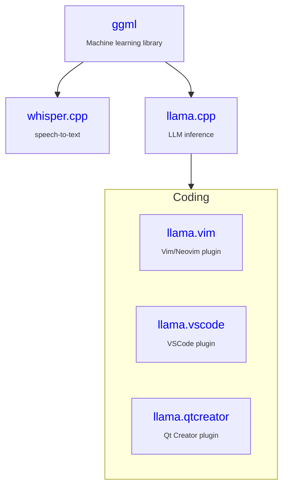

### News

- `[2025 Oct 28]` [ggml-org/llama.cpp featured in GitHub's Octoverse 2025 report as Top OSS by contributors](https://github.blog/news-insights/octoverse/octoverse-a-new-developer-joins-github-every-second-as-ai-leads-typescript-to-1/)
- `[2025 Oct 21]` [NVIDIA RTX 5090 outperforms AMD and Apple running local OpenAI language models](https://www.pcworld.com/article/2916928/nvidia-rtx-5090-outperforms-amd-and-apple-running-local-openai-language-models.html)
- `[2025 Sep 18]` [Latest Open-Source AMD Improvements Allowing For Better Llama.cpp AI Performance Against Windows 11](https://www.phoronix.com/review/llama-cpp-windows-linux)
- `[2025 Sep 09]` [Llama.cpp Meets Instinct: A New Era of Open-Source AI Acceleration](https://rocm.blogs.amd.com/ecosystems-and-partners/llama-cpp/README.html)
- `[2025 Aug 19]` [Firefox 142 Allows Browser Extensions/Add-Ons To Use AI LLMs](https://www.firefox.com/en-US/firefox/142.0/releasenotes/)
- `[2025 Aug 13]` [FFmpeg 8.0 Merges OpenAI Whisper Filter For Automatic Speech Recognition](https://www.phoronix.com/news/FFmpeg-Lands-Whisper)
- `[2025 Jul 30]` [MLCommons Releases MLPerf Client v1.0: A New Standard for AI PC and Client LLM Benchmarking](https://mlcommons.org/2025/07/mlperf-client-v1-0/)
- `[2025 Jul 26]` [Shotcut 25.07 Video Editor Introduces Speech to Text Model Downloader](https://9to5linux.com/shotcut-25-07-video-editor-introduces-speech-to-text-model-downloader)
- `[2025 Jul 10]` [Introducing LFM2: The Fastest On-Device Foundation Models on the Market](https://www.liquid.ai/blog/liquid-foundation-models-v2-our-second-series-of-generative-ai-models)
- `[2025 Jun 26]` [Introducing Gemma 3n: The developer guide](https://developers.googleblog.com/en/introducing-gemma-3n-developer-guide/)
- `[2025 Jun 23]` [Running and optimizing small language models on-premises and at the edge](https://aws.amazon.com/blogs/compute/running-and-optimizing-small-language-models-on-premises-and-at-the-edge/)
- `[2025 Jun 10]` [Docker Model Runner adds Qualcomm support](https://www.docker.com/blog/docker-desktop-4-42-native-ipv6-built-in-mcp-and-better-model-packaging/)
- `[2025 Jun 05]` [Run small language models cost-efficiently with AWS Graviton and Amazon SageMaker AI](https://aws.amazon.com/blogs/machine-learning/run-small-language-models-cost-efficiently-with-aws-graviton-and-amazon-sagemaker-ai/)
- `[2025 Jun 03]` [Try out Link Previews in Firefox Labs 138](https://connect.mozilla.org/t5/firefox-labs/try-out-link-previews-in-firefox-labs-138-and-share-your/td-p/92012)
- `[2025 May 29]` [Llama.cpp and GGML are optimized for NVIDIA RTX GPUs and the fifth-generation Tensor Cores](https://blogs.nvidia.com/blog/rtx-ai-garage-anythingllm-nim/)
- `[2025 May 08]` [LM Studio Accelerates LLM Performance With NVIDIA GeForce RTX GPUs and CUDA 12.8](https://blogs.nvidia.com/blog/rtx-ai-garage-lmstudio-llamacpp-blackwell/?linkId=100000364129480)
- `[2025 Apr 18]` [Gemma 3 QAT Models: Bringing state-of-the-Art AI to consumer GPUs](https://developers.googleblog.com/en/gemma-3-quantized-aware-trained-state-of-the-art-ai-to-consumer-gpus/)
- `[2025 Apr 16]` [Llama 4 Runs on Arm](https://newsroom.arm.com/blog/llama-4-runs-on-arm)
- `[2025 Apr 04]` [Run LLMs Locally with Docker](https://www.docker.com/blog/run-llms-locally/)
- `[2025 Mar 25]` [Deploy a Large Language Model (LLM) chatbot with llama.cpp using KleidiAI on Arm servers](https://learn.arm.com/learning-paths/servers-and-cloud-computing/llama-cpu/llama-chatbot/)
- `[2025 Feb 11]` [OLMoE, meet iOS](https://allenai.org/blog/olmoe-app)
- `[2024 Oct 02]` [Accelerating LLMs with llama.cpp on NVIDIA RTX Systems](https://developer.nvidia.com/blog/accelerating-llms-with-llama-cpp-on-nvidia-rtx-systems/)

### Use cases

| Chat                                                  | STT                                                                           | Mobile                                                            | Infra                                                           | Cloud                                                                                         | Code                                                          |
| ---                                                   | ---                                                                           | ---                                                               | ---                                                             | ---                                                                                           | ---                                                           |
| [LM Studio](https://lmstudio.ai)                      | [MacWhisper](https://goodsnooze.gumroad.com/l/macwhisper)                     | [PocketPal AI](https://github.com/a-ghorbani/pocketpal-ai)        | [RamaLama](https://github.com/containers/ramalama)              | [Hugging Face](https://huggingface.co/docs/inference-endpoints/en/guides/llamacpp_container)  | [llama.vim](https://github.com/ggml-org/llama.vim)            |
| [KoboldCpp](https://github.com/LostRuins/koboldcpp)   | [VLC media player](https://x.com/videolan/status/1877072497146781946)         | [LLMFarm](https://github.com/guinmoon/LLMFarm?tab=readme-ov-file) | [paddler](https://github.com/distantmagic/paddler)              |                                                                                               | [llama.vscode](https://github.com/ggml-org/llama.vscode)      |
| [LocalAI](https://github.com/mudler/LocalAI)          | [wchess](https://github.com/ggml-org/whisper.cpp/tree/master/examples/wchess) | [ChatterUI](https://github.com/Vali-98/ChatterUI)                 | [llama-swap](https://github.com/mostlygeek/llama-swap)          |                                                                                               | [VSCode](https://github.com/ggml-org/llama.cpp/pull/12896)    |
| [Jan](https://jan.ai)                                 | [superwhisper](https://superwhisper.com)                                      | [SmolChat](https://github.com/shubham0204/SmolChat-Android)       | [Docker Model Runner](https://docs.docker.com/ai/model-runner/) |                                                                                               |                                                               |
| [text-generation-webui](https://github.com/oobabooga/text-generation-webui)                                 | [hyprnote](https://github.com/fastrepl/hyprnote)       |                                                                   |                                                           |                                                                                               |                                                               |

### Partners

- [Hugging Face](./PARTNERS.md#hugging-face)
- [NVIDIA](./PARTNERS.md#nvidia)
