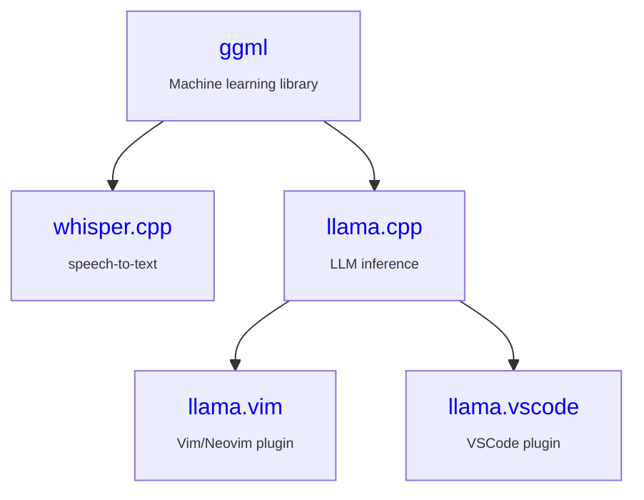

### Testimonials

- `[2025 Apr 18]` [Gemma 3 QAT Models: Bringing state-of-the-Art AI to consumer GPUs](https://developers.googleblog.com/en/gemma-3-quantized-aware-trained-state-of-the-art-ai-to-consumer-gpus/)
- `[2025 Apr 16]` [Llama 4 Runs on Arm](https://newsroom.arm.com/blog/llama-4-runs-on-arm)
- `[2025 Apr 04]` [Run LLMs Locally with Docker](https://www.docker.com/blog/run-llms-locally/)
- `[2025 Mar 25]` [Deploy a Large Language Model (LLM) chatbot with llama.cpp using KleidiAI on Arm servers](https://learn.arm.com/learning-paths/servers-and-cloud-computing/llama-cpu/llama-chatbot/)
- `[2025 Feb 11]` [OLMoE, meet iOS](https://allenai.org/blog/olmoe-app)
- `[2024 Oct 02]` [Accelerating LLMs with llama.cpp on NVIDIA RTX Systems](https://developer.nvidia.com/blog/accelerating-llms-with-llama-cpp-on-nvidia-rtx-systems/)

### Use cases

| Chat                                                  | STT                                                                           | Mobile                                                            | Infra                                                     | Cloud                                                                                         | Code                                                          |
| ---                                                   | ---                                                                           | ---                                                               | ---                                                       | ---                                                                                           | ---                                                           |
| [LM Studio](https://lmstudio.ai)                      | [MacWhisper](https://goodsnooze.gumroad.com/l/macwhisper)                     | [PocketPal AI](https://github.com/a-ghorbani/pocketpal-ai)        | [RamaLama](https://github.com/containers/ramalama)        | [Hugging Face](https://huggingface.co/docs/inference-endpoints/en/guides/llamacpp_container)  | [llama.vim](https://github.com/ggml-org/llama.vim)            |
| [KoboldCpp](https://github.com/LostRuins/koboldcpp)   | [VLC media player](https://x.com/videolan/status/1877072497146781946)         | [LLMFarm](https://github.com/guinmoon/LLMFarm?tab=readme-ov-file) | [paddler](https://github.com/distantmagic/paddler)        |                                                                                               | [llama.vscode](https://github.com/ggml-org/llama.vscode)      |
| [LocalAI](https://github.com/mudler/LocalAI)          | [wchess](https://github.com/ggml-org/whisper.cpp/tree/master/examples/wchess) |                                                                   | [llama-swap](https://github.com/mostlygeek/llama-swap)    |                                                                                               | [VSCode](https://github.com/ggml-org/llama.cpp/pull/12896)    |
| [Jan](https://jan.ai)                                 | [superwhisper](https://superwhisper.com)                                      |                                                                   |                                                           |                                                                                               |                                                               |

### Jobs

  - `ggml`/`llama.cpp` maintainer, full-time

    *apply at jobs@ggml.ai (only active contributors will be considered)*

### Partners

- [Hugging Face](./PARTNERS.md#hugging-face)
- [NVIDIA](./PARTNERS.md#nvidia)
