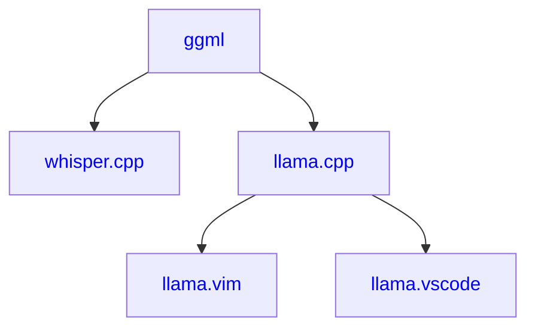

### Info

- Homepage: https://ggml.ai
- Cloud: https://endpoints.huggingface.co ([tutorial](https://huggingface.co/docs/inference-endpoints/en/guides/llamacpp_container))
- Jobs: jobs@ggml.ai
- Business: sales@ggml.ai

### Projects

### Used by

- Company 1
- Company 2

*(let us know if you are using `ggml` tech)*
